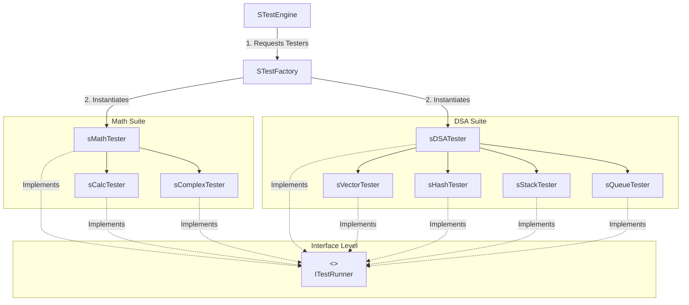

# Comprehensive Architecture & Technical Documentation: STestEngine

**Author:** Soumyajit C  
**Date:** 2026  
**Language:** C++ (C++14 / C++17 compatible)  
**Architecture:** Modular Test Framework utilizing **Composite** and **Factory** Design Patterns  

---

## Table of Contents
1. [Architectural Overview](#1-architectural-overview)
2. [Design Patterns Applied](#2-design-patterns-applied)
3. [Interface & Factory Specification](#3-interface--factory-specification)
   - [ITestRunner Interface](#31-itestrunner-interface)
   - [TestContext Enumeration](#32-testcontext-enumeration)
   - [STestFactory Header & Implementation](#33-stestfactory-header--implementation)
4. [Composite Test Suite Aggregators](#4-composite-test-suite-aggregators)
   - [sMathTester Suite](#41-smathtester-suite)
   - [sDSATester Suite](#42-sdsatester-suite)
5. [Concrete Leaf Test Implementations](#5-concrete-leaf-test-implementations)
   - [sCalcTester Implementation](#51-scalctester-implementation)
   - [sComplexTester Implementation](#52-scomplextester-implementation)
   - [sVectorTester Implementation](#53-svectortester-implementation)
6. [Top-Level Engine Orchestration](#6-top-level-engine-orchestration)
   - [STestEngine Header & Implementation](#61-stestengine-header--implementation)
   - [Main Entry Point Example](#62-main-entry-point-example)

---

## 1. Architectural Overview

The test architecture provides an extensible, decoupled, and hierarchical test execution environment. Individual data structure and mathematical module tests are encapsulated into concrete leaf runners, which are then aggregated into higher-level domain suites (`sMathTester` and `sDSATester`). A static factory handles context-driven instantiation, while the top-level `STestEngine` drives full lifecycle execution.